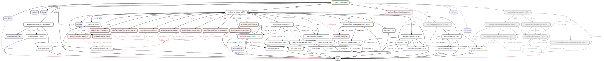

Composer Viz
############

|Packagist| |GitLab| |GitHub| |Codeberg| |Gitea|

A Composer plugin to generate dependency graph by GraphViz inspired by ``bundle viz``.

Installation
============

Install globally so you can use it on any project:

.. code-block:: bash

   composer global require arokettu/composer-viz:^2.2

The system should have GraphViz_ installed.

Usage
=====

.. code-block::

   composer viz [-o|--output OUTPUT] [-f|--format FORMAT]
                [--no-dev] [--no-php] [--no-ext] [--no-platform]
                [--no-pkg-versions] [--no-dep-versions] [--no-versions]

-o OUTPUT, --output=OUTPUT  Set output file. If not set, the result will be displayed from temporary file
-f FORMAT, --format=FORMAT  Set output file format. Useful if it is not detected from ``--output``
--no-dev                    Do not show development dependencies
--no-php                    Do not show PHP as a dependency (php and php64)
--no-ext                    Do not show extensions as dependencies
--no-platform               ``--no-php`` + ``--no-ext``
--no-pkg-versions           Do not show package versions on graph vertices
--no-dep-versions           Do not show package versions on graph edges
--no-versions               ``--no-pkg-versions`` + ``--no-dep-versions``

Examples
========

Running composer-viz 2.3.0 for itself: ``composer viz --output=composer-viz-2.3.0.svg``

More artificial example that shows more features (for ``sandbox/composer.json``):

Vertices:

* Green: root package
* White: regular package
* Grey: development dependency
* Blue: platform package (PHP, extensions, Composer API)
* Red: package is provided by another package

Edges:

* Black: regular dependency
* Grey: development dependency
* Red: 'provided by' relationship

GraphViz
========

You should install GraphViz on your system first.

Use this in Ubuntu:

.. code-block:: bash

   sudo apt-get install graphviz

Sometimes you may need additional packages like in Fedora you should also install ``graphviz-gd`` to be able
to export images, like this:

.. code-block:: bash

   # dot, svg and postscript work without graphviz-gd but png, jpeg and gif don't
   sudo dnf install graphviz graphviz-gd

License
=======

The library is available as open source under the terms of the `MIT License`_.

.. _MIT License:        https://opensource.org/licenses/MIT

.. |Packagist|  image:: https://img.shields.io/packagist/v/arokettu/composer-viz.svg?style=flat-square
   :target:     https://packagist.org/packages/arokettu/composer-viz
.. |GitHub|     image:: https://img.shields.io/badge/get%20on-GitHub-informational.svg?style=flat-square&logo=github
   :target:     https://github.com/arokettu/composer-viz
.. |GitLab|     image:: https://img.shields.io/badge/get%20on-GitLab-informational.svg?style=flat-square&logo=gitlab
   :target:     https://gitlab.com/sandfox/composer-viz
.. |Codeberg|   image:: https://img.shields.io/badge/get%20on-Codeberg-informational.svg?style=flat-square&logo=codeberg
   :target:     https://codeberg.org/sandfox/composer-viz
.. |Gitea|      image:: https://img.shields.io/badge/get%20on-Gitea-informational.svg?style=flat-square&logo=gitea
   :target:     https://sandfox.org/sandfox/composer-viz
